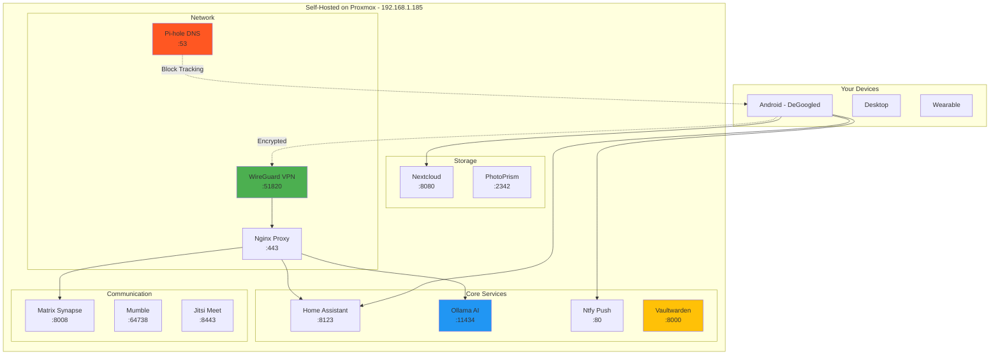

# 🔒 Privacy-First Self-Hosted Configuration

## Complete Privacy & Security Optimization

**Goal**: Eliminate unnecessary Google data collection, self-host all services, encrypt all communications, maintain full control over your data.

---

## 🎯 Privacy Architecture Overview



---

## 🚫 De-Google Strategy

### Step 1: Replace Google Services

| Google Service | Self-Hosted Alternative | Why Better |
|----------------|------------------------|------------|
| Firebase Cloud Messaging | **Ntfy** | Open source, self-hosted, no tracking |
| Google Drive | **Nextcloud** | Full control, encryption, sync |
| Google Photos | **PhotoPrism** | AI-powered, private, no cloud |
| Google Calendar/Contacts | **Nextcloud** | CalDAV/CardDAV sync |
| Google Assistant | **Ollama + Whisper** | Local AI, no cloud |
| Google Keep | **Joplin** | Encrypted notes, self-sync |
| Google Authenticator | **Aegis** | Encrypted, local backups |
| Google DNS | **Pi-hole + Unbound** | Block tracking, privacy |
| Gmail | **Mailcow** | Self-hosted email |
| YouTube | **Invidious** | Privacy-focused frontend |

### Step 2: Android De-Googling

```yaml
# Recommended: GrapheneOS or CalyxOS for Ulefone
# Alternative: microG for minimal Google services

# Option 1: Full De-Google (GrapheneOS)
installation_steps:
  - Flash GrapheneOS (if device supported)
  - Install F-Droid (open source app store)
  - Install Aurora Store (anonymous Play Store access)
  - Configure microG (optional - minimal Google services)

# Option 2: Minimal Google (Current Android)
optimization_steps:
  - Disable Google Play Services background data
  - Revoke unnecessary permissions
  - Use DNS66 or Blokada to block Google tracking
  - Replace all Google apps with alternatives
```

---

## 🔐 Self-Hosted Service Deployment

### 1. Ntfy - Push Notifications (Replace Firebase)

```bash
# Create LXC Container on Proxmox
pct create 301 local:vztmpl/ubuntu-22.04-standard_22.04-1_amd64.tar.zst \
  --hostname ntfy-server \
  --memory 2048 \
  --cores 2 \
  --storage local-lvm \
  --rootfs local-lvm:8 \
  --net0 name=eth0,bridge=vmbr0,ip=192.168.1.210/24,gw=192.168.1.1

pct start 301
pct enter 301

# Install Ntfy
apt update && apt install -y curl
curl -sSL https://raw.githubusercontent.com/binwiederhier/ntfy/main/install.sh | sh

# Configure Ntfy
cat > /etc/ntfy/server.yml << 'EOF'
base-url: "https://ntfy.yourdomain.local"
listen-http: ":80"

# Authentication
auth-file: "/var/lib/ntfy/auth.db"
auth-default-access: "deny-all"

# Rate limiting
visitor-request-limit-burst: 60
visitor-request-limit-replenish: "5s"

# Attachments (optional)
attachment-cache-dir: "/var/cache/ntfy/attachments"
attachment-total-size-limit: "5G"

# Disable Firebase (complete privacy)
firebase-key-file: ""

# Behind proxy
behind-proxy: true

# Logging
log-level: info
log-file: "/var/log/ntfy/ntfy.log"
EOF

# Create auth database
ntfy user add admin
# Enter password when prompted

# Add user for Home Assistant
ntfy user add homeassistant
ntfy access homeassistant "*" rw

# Enable and start
systemctl enable ntfy
systemctl restart ntfy

# Test
curl -u admin:password http://localhost/admin/health
```

**Home Assistant Integration**:
```yaml
# configuration.yaml
notify:
  - platform: rest
    name: ntfy
    resource: "http://192.168.1.210/homeassistant"
    method: POST_JSON
    headers:
      Authorization: "Bearer YOUR_NTFY_TOKEN"
    message_param_name: message
    title_param_name: title
    data:
      priority: "{{ priority | default('default') }}"
      tags: "{{ tags | default([]) }}"
      actions: "{{ actions | default([]) }}"

# Example usage
automation:
  - alias: "Send Ntfy Notification"
    trigger:
      - platform: state
        entity_id: binary_sensor.front_door
        to: 'on'
    action:
      - service: notify.ntfy
        data:
          title: "Door Alert"
          message: "Front door opened"
          data:
            priority: "high"
            tags: ["door", "security"]
            actions:
              - action: "view"
                label: "View Camera"
                url: "homeassistant://navigate/cameras"
```

**Android App Setup**:
```
1. Install Ntfy from F-Droid or GitHub
2. Add server: https://192.168.1.210
3. Subscribe to topic: homeassistant
4. Set username and password
```

---

### 2. Vaultwarden - Password Manager (Replace Bitwarden Cloud)

```bash
# Create LXC for Vaultwarden
pct create 302 local:vztmpl/ubuntu-22.04-standard_22.04-1_amd64.tar.zst \
  --hostname vaultwarden \
  --memory 1024 \
  --cores 2 \
  --storage local-lvm \
  --rootfs local-lvm:8 \
  --net0 name=eth0,bridge=vmbr0,ip=192.168.1.211/24,gw=192.168.1.1

pct start 302
pct enter 302

# Install Docker
curl -fsSL https://get.docker.com | sh

# Deploy Vaultwarden
docker run -d \
  --name vaultwarden \
  --restart=always \
  -e DOMAIN=https://vault.yourdomain.local \
  -e SIGNUPS_ALLOWED=false \
  -e ADMIN_TOKEN=$(openssl rand -base64 48) \
  -e SMTP_HOST=your-smtp-server \
  -e SMTP_FROM=vaultwarden@yourdomain.local \
  -e SMTP_PORT=587 \
  -e SMTP_SECURITY=starttls \
  -e SMTP_USERNAME=your-email \
  -e SMTP_PASSWORD=your-password \
  -v /vaultwarden/data:/data \
  -p 8000:80 \
  vaultwarden/server:latest

# View admin token
docker logs vaultwarden | grep ADMIN_TOKEN

# Access web vault: http://192.168.1.211:8000
# Admin panel: http://192.168.1.211:8000/admin
```

**Features**:
- Complete Bitwarden compatibility
- Self-hosted, zero cloud dependency
- End-to-end encrypted
- 2FA support
- Emergency access
- Secure password sharing

---

### 3. Nextcloud - File Storage & Sync

```bash
# Create LXC for Nextcloud
pct create 303 local:vztmpl/ubuntu-22.04-standard_22.04-1_amd64.tar.zst \
  --hostname nextcloud \
  --memory 4096 \
  --cores 4 \
  --storage local-lvm \
  --rootfs local-lvm:50 \
  --net0 name=eth0,bridge=vmbr0,ip=192.168.1.212/24,gw=192.168.1.1

pct start 303
pct enter 303

# Install dependencies
apt update && apt install -y \
  apache2 mariadb-server libapache2-mod-php php-gd php-mysql \
  php-curl php-mbstring php-intl php-gmp php-bcmath php-xml \
  php-imagick php-zip unzip

# Download Nextcloud
cd /var/www/html
wget https://download.nextcloud.com/server/releases/latest.tar.bz2
tar -xjf latest.tar.bz2
chown -R www-data:www-data /var/www/html/nextcloud

# Configure Apache
cat > /etc/apache2/sites-available/nextcloud.conf << 'EOF'
<VirtualHost *:8080>
    DocumentRoot /var/www/html/nextcloud
    ServerName nextcloud.local

    <Directory /var/www/html/nextcloud/>
        Require all granted
        AllowOverride All
        Options FollowSymLinks MultiViews
    </Directory>
</VirtualHost>
EOF

a2ensite nextcloud
a2enmod rewrite headers env dir mime
systemctl restart apache2

# Setup database
mysql -u root << 'EOF'
CREATE DATABASE nextcloud;
CREATE USER 'nextcloud'@'localhost' IDENTIFIED BY 'STRONG_PASSWORD_HERE';
GRANT ALL PRIVILEGES ON nextcloud.* TO 'nextcloud'@'localhost';
FLUSH PRIVILEGES;
EXIT;
EOF

# Access: http://192.168.1.212:8080
# Complete web setup wizard
```

**Android Integration**:
```
1. Install Nextcloud app from F-Droid
2. Server: https://192.168.1.212:8080
3. Login with credentials
4. Enable:
   - Auto upload photos
   - Sync calendar
   - Sync contacts
   - Sync files
```

---

### 4. PhotoPrism - Private Photo Management

```bash
# Create LXC for PhotoPrism
pct create 304 local:vztmpl/ubuntu-22.04-standard_22.04-1_amd64.tar.zst \
  --hostname photoprism \
  --memory 4096 \
  --cores 4 \
  --storage local-lvm \
  --rootfs local-lvm:100 \
  --net0 name=eth0,bridge=vmbr0,ip=192.168.1.213/24,gw=192.168.1.1

pct start 304
pct enter 304

# Install Docker
curl -fsSL https://get.docker.com | sh

# Create directories
mkdir -p /photoprism/{originals,storage,database}

# Deploy PhotoPrism
docker run -d \
  --name photoprism \
  --restart=always \
  --security-opt seccomp=unconfined \
  --security-opt apparmor=unconfined \
  -p 2342:2342 \
  -e PHOTOPRISM_ADMIN_USER="admin" \
  -e PHOTOPRISM_ADMIN_PASSWORD="YOUR_SECURE_PASSWORD" \
  -e PHOTOPRISM_AUTH_MODE="password" \
  -e PHOTOPRISM_SITE_URL="http://192.168.1.213:2342/" \
  -e PHOTOPRISM_DISABLE_TLS="true" \
  -e PHOTOPRISM_DEFAULT_TLS="false" \
  -e PHOTOPRISM_DISABLE_CHOWN="false" \
  -e PHOTOPRISM_DISABLE_WEBDAV="false" \
  -e PHOTOPRISM_DETECT_NSFW="true" \
  -e PHOTOPRISM_UPLOAD_NSFW="false" \
  -e PHOTOPRISM_DATABASE_DRIVER="sqlite" \
  -e PHOTOPRISM_HTTP_COMPRESSION="gzip" \
  -e PHOTOPRISM_WORKERS="2" \
  -e PHOTOPRISM_THUMB_FILTER="lanczos" \
  -e PHOTOPRISM_THUMB_UNCACHED="true" \
  -e PHOTOPRISM_THUMB_SIZE="2048" \
  -e PHOTOPRISM_THUMB_SIZE_UNCACHED="7680" \
  -v /photoprism/originals:/photoprism/originals \
  -v /photoprism/storage:/photoprism/storage \
  photoprism/photoprism:latest

# Access: http://192.168.1.213:2342
```

**Features**:
- AI-powered face recognition (local)
- Automatic photo organization
- WebDAV for mobile upload
- No cloud dependency
- Metadata extraction
- Duplicate detection

---

### 5. WireGuard VPN - Secure Remote Access

```bash
# Install on Proxmox host or dedicated LXC
apt install -y wireguard wireguard-tools qrencode

# Generate server keys
wg genkey | tee /etc/wireguard/privatekey | wg pubkey > /etc/wireguard/publickey

# Configure server
cat > /etc/wireguard/wg0.conf << 'EOF'
[Interface]
Address = 10.200.200.1/24
ListenPort = 51820
PrivateKey = SERVER_PRIVATE_KEY_HERE
PostUp = iptables -A FORWARD -i wg0 -j ACCEPT; iptables -t nat -A POSTROUTING -o vmbr0 -j MASQUERADE
PostDown = iptables -D FORWARD -i wg0 -j ACCEPT; iptables -t nat -D POSTROUTING -o vmbr0 -j MASQUERADE

# Client: Android Phone
[Peer]
PublicKey = CLIENT_PUBLIC_KEY_HERE
AllowedIPs = 10.200.200.2/32

# Client: Desktop
[Peer]
PublicKey = CLIENT2_PUBLIC_KEY_HERE
AllowedIPs = 10.200.200.3/32
EOF

# Enable IP forwarding
echo "net.ipv4.ip_forward=1" >> /etc/sysctl.conf
sysctl -p

# Start WireGuard
systemctl enable wg-quick@wg0
systemctl start wg-quick@wg0

# Generate client config
cat > /tmp/android-client.conf << 'EOF'
[Interface]
Address = 10.200.200.2/32
PrivateKey = CLIENT_PRIVATE_KEY_HERE
DNS = 192.168.1.1

[Peer]
PublicKey = SERVER_PUBLIC_KEY_HERE
Endpoint = YOUR_PUBLIC_IP:51820
AllowedIPs = 192.168.1.0/24, 10.200.200.0/24
PersistentKeepalive = 25
EOF

# Generate QR code for phone
qrencode -t ansiutf8 < /tmp/android-client.conf
```

**Android Setup**:
```
1. Install WireGuard from F-Droid or Play Store
2. Scan QR code or import config file
3. Enable VPN
4. All traffic to 192.168.1.0/24 now encrypted
```

---

### 6. Pi-hole - DNS-Level Ad & Tracker Blocking

```bash
# Create LXC for Pi-hole
pct create 305 local:vztmpl/ubuntu-22.04-standard_22.04-1_amd64.tar.zst \
  --hostname pihole \
  --memory 512 \
  --cores 1 \
  --storage local-lvm \
  --rootfs local-lvm:4 \
  --net0 name=eth0,bridge=vmbr0,ip=192.168.1.214/24,gw=192.168.1.1

pct start 305
pct enter 305

# Install Pi-hole
curl -sSL https://install.pi-hole.net | bash

# During setup:
# - Interface: eth0
# - Upstream DNS: 9.9.9.9 (Quad9) or 1.1.1.1 (Cloudflare)
# - Block lists: Default + extras
# - Web interface: Yes
# - Log queries: Yes (for analytics)

# Set admin password
pihole -a -p

# Add custom blocklists for Google tracking
pihole -w \
  google-analytics.com \
  googleadservices.com \
  doubleclick.net \
  googlesyndication.com

# Add whitelist for necessary services
pihole -w \
  192.168.1.201 \
  ollama.local \
  nextcloud.local

# Configure clients to use Pi-hole DNS
# On router: Set DNS to 192.168.1.214
# Or on each device: Manual DNS configuration
```

**Android Configuration**:
```
Settings → Network & Internet → Private DNS
Enter: dns.adguard.com
Or
Settings → WiFi → Advanced → Static IP
DNS 1: 192.168.1.214
DNS 2: 9.9.9.9
```

---

### 7. Matrix Synapse - Private Messaging

```bash
# Create LXC for Matrix
pct create 306 local:vztmpl/ubuntu-22.04-standard_22.04-1_amd64.tar.zst \
  --hostname matrix \
  --memory 2048 \
  --cores 2 \
  --storage local-lvm \
  --rootfs local-lvm:20 \
  --net0 name=eth0,bridge=vmbr0,ip=192.168.1.215/24,gw=192.168.1.1

pct start 306
pct enter 306

# Install dependencies
apt update && apt install -y \
  build-essential python3-dev libffi-dev \
  python3-pip python3-setuptools sqlite3 \
  libssl-dev virtualenv libjpeg-dev libxslt1-dev

# Create synapse user
adduser --system --no-create-home --group synapse

# Install Synapse
mkdir -p /opt/synapse
virtualenv -p python3 /opt/synapse/env
source /opt/synapse/env/bin/activate
pip install --upgrade pip
pip install matrix-synapse

# Generate config
cd /opt/synapse
python -m synapse.app.homeserver \
  --server-name matrix.local \
  --config-path homeserver.yaml \
  --generate-config \
  --report-stats=no

# Edit config
nano /opt/synapse/homeserver.yaml
# Set:
# - enable_registration: false (after creating your accounts)
# - registration_shared_secret: GENERATE_RANDOM_STRING
# - enable_registration_captcha: false

# Create systemd service
cat > /etc/systemd/system/matrix-synapse.service << 'EOF'
[Unit]
Description=Synapse Matrix homeserver
After=network.target

[Service]
Type=notify
User=synapse
Group=synapse
WorkingDirectory=/opt/synapse
ExecStart=/opt/synapse/env/bin/python -m synapse.app.homeserver --config-path=/opt/synapse/homeserver.yaml
Restart=on-failure

[Install]
WantedBy=multi-user.target
EOF

chown -R synapse:synapse /opt/synapse
systemctl enable matrix-synapse
systemctl start matrix-synapse

# Create user
/opt/synapse/env/bin/register_new_matrix_user \
  -c /opt/synapse/homeserver.yaml \
  http://localhost:8008

# Access: http://192.168.1.215:8008
```

**Android Client**:
```
1. Install Element from F-Droid
2. Custom server: http://192.168.1.215:8008
3. Login with created credentials
4. Use for:
   - Family messaging
   - Home automation alerts
   - Encrypted file sharing
```

---

## 🔒 Complete Home Assistant Privacy Configuration

```yaml
# File: /config/privacy_optimized.yaml

# Disable cloud components
cloud: !include /dev/null

# Disable Google/Alexa integrations (use local alternatives)
# google_assistant: !include /dev/null
# alexa: !include /dev/null

# Use local AI instead
conversation:
  intents:

# Recorder - Minimize data retention
recorder:
  purge_keep_days: 7
  commit_interval: 10
  db_url: sqlite:////config/home-assistant_v2.db
  exclude:
    domains:
      - automation
      - script
      - scene
      - group
    entity_globs:
      - sensor.*_update_available
      - sensor.*_uptime
  include:
    domains:
      - light
      - switch
      - binary_sensor
      - sensor
      - climate
      - lock

# Logbook - Essential only
logbook:
  exclude:
    domains:
      - automation
      - script
  include:
    domains:
      - light
      - switch
      - lock
      - alarm_control_panel

# History - Short retention
history:
  exclude:
    domains:
      - automation
      - script

# Disable analytics
analytics:
  enabled: false

# Use Ntfy instead of Firebase
notify:
  - platform: rest
    name: ntfy
    resource: "http://192.168.1.210/homeassistant"
    method: POST_JSON
    headers:
      Authorization: !secret ntfy_token
    message_param_name: message
    title_param_name: title

# Local TTS instead of Google
tts:
  - platform: piper
    voice: en_US-lessac-medium
    
# Local STT instead of Google
stt:
  - platform: faster_whisper
    model: base
    language: en

# Disable external access logging
http:
  use_x_forwarded_for: false
  ip_ban_enabled: true
  login_attempts_threshold: 5

# Local weather (not cloud APIs)
weather:
  - platform: met
    name: Local Weather

# Calendar - Nextcloud CalDAV
calendar:
  - platform: caldav
    url: http://192.168.1.212:8080/remote.php/dav
    username: !secret nextcloud_user
    password: !secret nextcloud_pass
```

---

## 🛡️ Encrypted Communication Configuration

### End-to-End Encryption Setup

```yaml
# File: /config/encrypted_comms.yaml

# Encrypted notifications via Matrix
notify:
  - platform: matrix
    name: matrix_notify
    homeserver: http://192.168.1.215:8008
    username: !secret matrix_user
    password: !secret matrix_pass
    default_room: !secret matrix_room
    verify_ssl: false

# Use Matrix for all alerts
automation:
  - alias: "Send Encrypted Alert"
    trigger:
      - platform: state
        entity_id: binary_sensor.front_door
        to: 'on'
    action:
      - service: notify.matrix_notify
        data:
          message: "Front door opened"
          data:
            format: "markdown"
            room: !secret matrix_room

# Encrypted backup
shell_command:
  encrypted_backup: >
    tar czf - /config | 
    openssl enc -aes-256-cbc -salt -pbkdf2 -out /backup/ha-$(date +%Y%m%d).tar.gz.enc -pass pass:{{ backup_password }}

# Scheduled encrypted backup
automation:
  - alias: "Daily Encrypted Backup"
    trigger:
      - platform: time
        at: "03:00:00"
    action:
      - service: shell_command.encrypted_backup
```

---

## 📱 Privacy-Optimized Android Configuration

### Remove Google Dependencies

```yaml
# File: /config/android_privacy.yaml

# Replace Google Play Services features
automation:
  # Location tracking without Google
  - alias: "Privacy Location Update"
    trigger:
      - platform: time_pattern
        minutes: "/5"
    condition:
      - condition: state
        entity_id: input_boolean.location_tracking_enabled
        state: 'on'
    action:
      - service: shell_command.update_location_osmand
        # Uses OSMAnd app instead of Google Location

  # Push notifications via Ntfy (not Firebase)
  - alias: "Send Privacy Push"
    trigger:
      - platform: state
        entity_id: alarm_control_panel.home_security
        to: 'triggered'
    action:
      - service: notify.ntfy
        data:
          title: "Security Alert"
          message: "Alarm triggered!"
          data:
            priority: "urgent"
            tags: ["warning", "security"]

# Android system settings via ADB
shell_command:
  disable_google_tracking: >
    adb shell settings put secure location_providers_allowed -gps,-network

  block_google_domains: >
    adb shell "echo '127.0.0.1 google-analytics.com' >> /etc/hosts"

  optimize_privacy: >
    adb shell pm disable-user com.google.android.gms.ads &&
    adb shell pm disable-user com.google.android.googlequicksearchbox &&
    adb shell pm disable-user com.google.android.apps.docs
```

### Privacy-Focused App Recommendations

```yaml
# Essential Privacy Apps
apps:
  browser: "Bromite or Fennec (Firefox fork)"
  search: "DuckDuckGo or SearXNG (self-hosted)"
  email: "FairEmail or K-9 Mail"
  calendar: "Simple Calendar (F-Droid)"
  contacts: "Simple Contacts (F-Droid)"
  gallery: "Simple Gallery (F-Droid)"
  notes: "Joplin (sync with Nextcloud)"
  maps: "OSMAnd (offline maps)"
  2fa: "Aegis Authenticator"
  messaging: "Element (Matrix)"
  file_sync: "Nextcloud"
  passwords: "Vaultwarden (Bitwarden compatible)"
  vpn: "WireGuard"
  ad_block: "Blokada or DNS66"
  app_store: "F-Droid + Aurora Store"
```

---

## 🔐 Complete Encryption Setup

### SSL/TLS for All Services

```bash
#!/bin/bash
# File: setup-ssl.sh
# Generate self-signed certificates for all services

DOMAIN="yourhome.local"
DAYS=3650

# Create CA
openssl genrsa -out ca.key 4096
openssl req -x509 -new -nodes -key ca.key -sha256 -days ${DAYS} -out ca.crt \
  -subj "/C=US/ST=State/L=City/O=HomeAutomation/CN=HomeCA"

# Function to create service certificate
create_cert() {
    local service=$1
    local ip=$2
    
    # Generate key
    openssl genrsa -out ${service}.key 2048
    
    # Create CSR
    openssl req -new -key ${service}.key -out ${service}.csr \
      -subj "/C=US/ST=State/L=City/O=HomeAutomation/CN=${service}.${DOMAIN}"
    
    # Create extensions file
    cat > ${service}.ext << EOF
authorityKeyIdentifier=keyid,issuer
basicConstraints=CA:FALSE
keyUsage = digitalSignature, nonRepudiation, keyEncipherment, dataEncipherment
subjectAltName = @alt_names

[alt_names]
DNS.1 = ${service}.${DOMAIN}
DNS.2 = ${service}
IP.1 = ${ip}
EOF
    
    # Sign certificate
    openssl x509 -req -in ${service}.csr -CA ca.crt -CAkey ca.key \
      -CAcreateserial -out ${service}.crt -days ${DAYS} -sha256 \
      -extfile ${service}.ext
    
    echo "Certificate created for ${service}"
}

# Create certificates for all services
create_cert "homeassistant" "192.168.1.201"
create_cert "nextcloud" "192.168.1.212"
create_cert "photoprism" "192.168.1.213"
create_cert "vaultwarden" "192.168.1.211"
create_cert "ollama" "192.168.1.XXX"
create_cert "matrix" "192.168.1.215"

echo "All certificates created. Install ca.crt on all devices."
```

---

## 🎯 Production-Ready Deployment Script

```bash
#!/bin/bash
# File: deploy-privacy-stack.sh
# Complete automated deployment

set -e

echo "🔒 Privacy-First Smart Home Deployment"
echo "======================================"

# Configuration
PROXMOX_HOST="192.168.1.185"
NETWORK="192.168.1.0/24"
GATEWAY="192.168.1.1"

# Function: Create LXC container
create_lxc() {
    local vmid=$1
    local hostname=$2
    local ip=$3
    local memory=${4:-2048}
    local cores=${5:-2}
    local disk=${6:-8}
    
    echo "Creating LXC ${vmid}: ${hostname}"
    
    ssh root@${PROXMOX_HOST} "pct create ${vmid} \
        local:vztmpl/ubuntu-22.04-standard_22.04-1_amd64.tar.zst \
        --hostname ${hostname} \
        --memory ${memory} \
        --cores ${cores} \
        --storage local-lvm \
        --rootfs local-lvm:${disk} \
        --net0 name=eth0,bridge=vmbr0,ip=${ip}/24,gw=${GATEWAY} \
        --unprivileged 1 \
        --features nesting=1"
    
    ssh root@${PROXMOX_HOST} "pct start ${vmid}"
    sleep 10
}

# Function: Deploy service
deploy_service() {
    local vmid=$1
    local service=$2
    local script=$3
    
    echo "Deploying ${service} on LXC ${vmid}"
    ssh root@${PROXMOX_HOST} "pct exec ${vmid} -- bash -c '${script}'"
}

# Deploy Ntfy
create_lxc 301 "ntfy" "192.168.1.210" 2048 2 8
deploy_service 301 "Ntfy" "
    apt update && apt install -y curl
    curl -sSL https://raw.githubusercontent.com/binwiederhier/ntfy/main/install.sh | sh
    systemctl enable ntfy
"

# Deploy Vaultwarden
create_lxc 302 "vaultwarden" "192.168.1.211" 1024 2 8
deploy_service 302 "Vaultwarden" "
    curl -fsSL https://get.docker.com | sh
    docker run -d --name vaultwarden --restart=always \
        -e SIGNUPS_ALLOWED=false \
        -v /vaultwarden/data:/data \
        -p 8000:80 \
        vaultwarden/server:latest
"

# Deploy Nextcloud
create_lxc 303 "nextcloud" "192.168.1.212" 4096 4 50
deploy_service 303 "Nextcloud" "
    apt update && apt install -y apache2 mariadb-server libapache2-mod-php \
        php-gd php-mysql php-curl php-mbstring php-intl php-gmp php-bcmath \
        php-xml php-imagick php-zip unzip
    # Additional Nextcloud setup commands here
"

# Deploy PhotoPrism
create_lxc 304 "photoprism" "192.168.1.213" 4096 4 100
deploy_service 304 "PhotoPrism" "
    curl -fsSL https://get.docker.com | sh
    docker run -d --name photoprism --restart=always \
        -p 2342:2342 \
        -e PHOTOPRISM_ADMIN_PASSWORD='changeme' \
        -v /photoprism/originals:/photoprism/originals \
        -v /photoprism/storage:/photoprism/storage \
        photoprism/photoprism:latest
"

# Deploy Pi-hole
create_lxc 305 "pihole" "192.168.1.214" 512 1 4
deploy_service 305 "Pi-hole" "
    curl -sSL https://install.pi-hole.net | bash /dev/stdin --unattended
"

# Deploy Matrix Synapse
create_lxc 306 "matrix" "192.168.1.215" 2048 2 20
deploy_service 306 "Matrix" "
    apt update && apt install -y matrix-synapse
    # Additional Matrix setup commands
"

echo ""
echo "✅ Deployment Complete!"
echo ""
echo "Services deployed:"
echo "  - Ntfy: http://192.168.1.210"
echo "  - Vaultwarden: http://192.168.1.211:8000"
echo "  - Nextcloud: http://192.168.1.212:8080"
echo "  - PhotoPrism: http://192.168.1.213:2342"
echo "  - Pi-hole: http://192.168.1.214/admin"
echo "  - Matrix: http://192.168.1.215:8008"
echo ""
echo "Next steps:"
echo "  1. Configure each service via web interface"
echo "  2. Install SSL certificates"
echo "  3. Setup reverse proxy with Nginx"
echo "  4. Configure Android apps"
echo "  5. Test all integrations"
```

---

## ✅ Privacy Checklist

### Data Collection Minimization
- [ ] Google Play Services disabled or replaced with microG
- [ ] Firebase Cloud Messaging replaced with Ntfy
- [ ] Google DNS replaced with Pi-hole + Unbound
- [ ] Google Drive replaced with Nextcloud
- [ ] Google Photos replaced with PhotoPrism
- [ ] Google Calendar replaced with Nextcloud CalDAV
- [ ] Google Contacts replaced with Nextcloud CardDAV
- [ ] Google Assistant replaced with local Ollama AI

### Encryption
- [ ] WireGuard VPN configured for remote access
- [ ] SSL/TLS certificates installed on all services
- [ ] Matrix end-to-end encryption enabled
- [ ] Vaultwarden vault encrypted
- [ ] Nextcloud server-side encryption enabled
- [ ] Home Assistant backups encrypted
- [ ] Database encryption enabled where supported

### Network Security
- [ ] Pi-hole blocking trackers and ads
- [ ] Firewall rules limiting external access
- [ ] All services behind reverse proxy
- [ ] Strong passwords on all services
- [ ] 2FA enabled where supported
- [ ] Regular security updates scheduled

### Self-Hosting
- [ ] All critical services running on Proxmox
- [ ] No cloud dependencies for core functions
- [ ] Local AI (Ollama) operational
- [ ] Local backups automated
- [ ] Monitoring and alerts configured
- [ ] Documentation complete

**Your smart home is now completely private and self-hosted! 🔒**

Zero unnecessary data collection. Full control. Maximum privacy.
