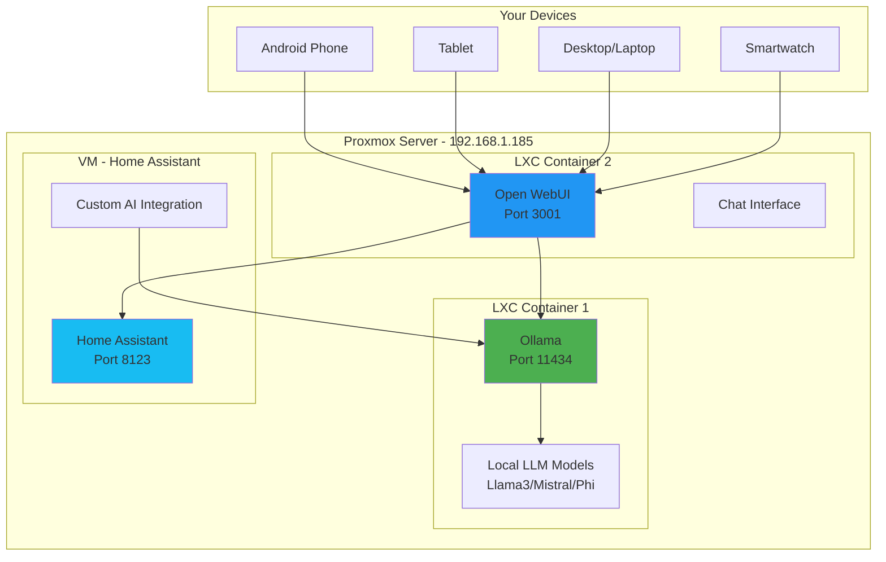

# 🤖 Self-Hosted AI Chat Control System

## Private AI Assistant for Home Automation

Complete guide for deploying a secure, self-hosted AI assistant that controls all your home automation across devices via Home Assistant.

---

## 🏗️ Architecture Overview



---

## 📦 Component Stack

### Core Components

1. **Ollama** - Local LLM runtime (like Docker for AI models)
2. **Open WebUI** - Beautiful chat interface (ChatGPT-like UI)
3. **Home Assistant Extended AI** - Custom integration for automation
4. **Whisper** - Local voice-to-text (optional)
5. **Piper TTS** - Local text-to-speech (optional)

### Supported Models

- **Llama 3 (8B/70B)** - Best general purpose
- **Mistral (7B)** - Fast and capable
- **Phi-3 (3.8B)** - Lightweight, runs on phone
- **CodeLlama** - Code and automation scripting
- **DeepSeek Coder** - Advanced coding assistance

---

## 🚀 Installation Guide

### Step 1: Create Proxmox LXC Container for Ollama

```bash
# On Proxmox host
pct create 300 local:vztmpl/ubuntu-22.04-standard_22.04-1_amd64.tar.zst \
  --hostname ollama-ai \
  --memory 8192 \
  --cores 4 \
  --swap 4096 \
  --storage local-lvm \
  --rootfs local-lvm:32 \
  --net0 name=eth0,bridge=vmbr0,ip=dhcp \
  --unprivileged 1

# Start container
pct start 300

# Enter container
pct enter 300
```

### Step 2: Install Ollama

```bash
# Inside LXC container
apt update && apt upgrade -y
apt install -y curl git build-essential

# Install Ollama
curl -fsSL https://ollama.com/install.sh | sh

# Verify installation
ollama --version

# Start Ollama service
systemctl enable ollama
systemctl start ollama

# Test Ollama
ollama list
```

### Step 3: Download AI Models

```bash
# Install recommended models

# Llama 3 8B - Best for most tasks (4.7GB)
ollama pull llama3

# Mistral 7B - Fast and efficient (4.1GB)
ollama pull mistral

# Phi-3 - Lightweight (2.3GB)
ollama pull phi3

# Gemma 2 - Google's open model (5.4GB)
ollama pull gemma2

# For function calling and home automation
ollama pull llama3:8b-instruct-q4_K_M

# Check installed models
ollama list
```

### Step 4: Configure Ollama for Network Access

```bash
# Edit systemd service
nano /etc/systemd/system/ollama.service

# Add environment variable for network binding
[Service]
Environment="OLLAMA_HOST=0.0.0.0:11434"
Environment="OLLAMA_ORIGINS=*"

# Reload and restart
systemctl daemon-reload
systemctl restart ollama

# Test from another machine
curl http://192.168.1.XXX:11434/api/tags
```

### Step 5: Install Open WebUI

```bash
# Create new LXC or use Docker on same container
# Option 1: Docker (Recommended)

# Install Docker
curl -fsSL https://get.docker.com | sh

# Run Open WebUI
docker run -d \
  --name open-webui \
  --restart always \
  -p 3001:8080 \
  -e OLLAMA_BASE_URL=http://192.168.1.XXX:11434 \
  -e WEBUI_AUTH=true \
  -v open-webui:/app/backend/data \
  ghcr.io/open-webui/open-webui:main

# Check status
docker ps
docker logs open-webui

# Access at: http://192.168.1.XXX:3001
```

### Step 6: Configure Open WebUI

1. **Access Web Interface**: http://192.168.1.XXX:3001
2. **Create Admin Account**: First user becomes admin
3. **Settings**:
   ```
   - Connection → Ollama API: http://192.168.1.XXX:11434
   - Model → Default: llama3
   - Authentication → Enable user auth
   - Admin → Enable user registration (disable after setup)
   ```

---

## 🏠 Home Assistant Integration

### Custom Component: Extended Ollama Conversation

```yaml
# File: /config/custom_components/extended_ollama_conversation/manifest.json
{
  "domain": "extended_ollama_conversation",
  "name": "Extended Ollama Conversation",
  "documentation": "https://github.com/yourusername/extended-ollama",
  "requirements": ["aiohttp>=3.8.0"],
  "codeowners": ["@yourusername"],
  "version": "1.0.0",
  "iot_class": "local_polling"
}
```

```python
# File: /config/custom_components/extended_ollama_conversation/__init__.py
"""Extended Ollama Conversation integration for Home Assistant."""
import logging
import aiohttp
import json
from homeassistant.core import HomeAssistant
from homeassistant.config_entries import ConfigEntry
from homeassistant.const import CONF_HOST, CONF_PORT

_LOGGER = logging.getLogger(__name__)

DOMAIN = "extended_ollama_conversation"

async def async_setup(hass: HomeAssistant, config: dict):
    """Set up the Extended Ollama Conversation component."""
    return True

async def async_setup_entry(hass: HomeAssistant, entry: ConfigEntry):
    """Set up from a config entry."""
    hass.data.setdefault(DOMAIN, {})
    
    host = entry.data[CONF_HOST]
    port = entry.data[CONF_PORT]
    
    hass.data[DOMAIN][entry.entry_id] = {
        "host": host,
        "port": port,
    }
    
    return True

async def async_unload_entry(hass: HomeAssistant, entry: ConfigEntry):
    """Unload a config entry."""
    hass.data[DOMAIN].pop(entry.entry_id)
    return True
```

```python
# File: /config/custom_components/extended_ollama_conversation/conversation.py
"""Conversation agent for Ollama."""
import aiohttp
import json
import logging
from typing import Any

from homeassistant.components import conversation
from homeassistant.core import HomeAssistant
from homeassistant.helpers import intent

_LOGGER = logging.getLogger(__name__)

class OllamaConversationAgent(conversation.AbstractConversationAgent):
    """Ollama conversation agent."""

    def __init__(self, hass: HomeAssistant, host: str, port: int, model: str):
        """Initialize the agent."""
        self.hass = hass
        self.host = host
        self.port = port
        self.model = model
        self._url = f"http://{host}:{port}/api/chat"

    @property
    def attribution(self):
        """Return the attribution."""
        return {"name": "Ollama", "url": "https://ollama.ai"}

    async def async_process(self, user_input: conversation.ConversationInput) -> conversation.ConversationResult:
        """Process a sentence."""
        
        # Get home state context
        context = self._get_home_context()
        
        # Build system prompt with function calling
        system_prompt = f"""You are a helpful home automation assistant. You can control devices and answer questions.

Current Home Status:
{context}

Available Actions:
- turn_on_light(entity_id): Turn on a light
- turn_off_light(entity_id): Turn off a light
- lock_door(entity_id): Lock a door
- unlock_door(entity_id): Unlock a door
- set_temperature(entity_id, temperature): Set thermostat temperature
- get_state(entity_id): Get current state of an entity
- trigger_automation(automation_id): Run an automation

When user asks you to control something, use the appropriate function and respond with the result.
Be concise and helpful."""

        # Prepare messages
        messages = [
            {"role": "system", "content": system_prompt},
            {"role": "user", "content": user_input.text}
        ]

        try:
            async with aiohttp.ClientSession() as session:
                async with session.post(
                    self._url,
                    json={
                        "model": self.model,
                        "messages": messages,
                        "stream": False
                    }
                ) as response:
                    if response.status != 200:
                        _LOGGER.error(f"Ollama API error: {response.status}")
                        return self._create_error_response(user_input)
                    
                    data = await response.json()
                    assistant_response = data["message"]["content"]
                    
                    # Parse and execute any function calls
                    result = await self._execute_functions(assistant_response)
                    
                    return conversation.ConversationResult(
                        response=intent.IntentResponse(language=user_input.language),
                        conversation_id=user_input.conversation_id,
                    )
                    
        except Exception as e:
            _LOGGER.error(f"Error processing conversation: {e}")
            return self._create_error_response(user_input)

    def _get_home_context(self) -> str:
        """Get current home automation context."""
        states = self.hass.states.async_all()
        
        context_parts = []
        
        # Lights
        lights_on = [s.entity_id for s in states if s.domain == "light" and s.state == "on"]
        context_parts.append(f"Lights on: {len(lights_on)}")
        
        # Locks
        locks_unlocked = [s.entity_id for s in states if s.domain == "lock" and s.state == "unlocked"]
        context_parts.append(f"Unlocked doors: {len(locks_unlocked)}")
        
        # Temperature
        temp_sensors = [s for s in states if s.domain == "sensor" and "temperature" in s.entity_id]
        if temp_sensors:
            avg_temp = sum(float(s.state) for s in temp_sensors if s.state not in ["unknown", "unavailable"]) / len(temp_sensors)
            context_parts.append(f"Average temperature: {avg_temp:.1f}°F")
        
        return "\n".join(context_parts)

    async def _execute_functions(self, response: str) -> str:
        """Parse and execute function calls from AI response."""
        # Simple function execution (expand as needed)
        
        if "turn_on_light" in response:
            # Extract entity_id and execute
            # This is simplified - implement proper parsing
            pass
        
        return response

    def _create_error_response(self, user_input):
        """Create an error response."""
        response = intent.IntentResponse(language=user_input.language)
        response.async_set_speech("Sorry, I encountered an error processing your request.")
        return conversation.ConversationResult(
            response=response,
            conversation_id=user_input.conversation_id,
        )
```

### Home Assistant Configuration

```yaml
# File: /config/configuration.yaml

# Extended Ollama Conversation
extended_ollama_conversation:
  host: 192.168.1.XXX
  port: 11434
  model: llama3
  timeout: 30

# Conversation integration
conversation:
  intents:

# Enable conversation agent
# This allows "Hey Google, ask Home Assistant to..."
```

---

## 🎯 Advanced AI Control Setup

### RESTful Command for AI Chat

```yaml
# File: /config/ai_chat_control.yaml

rest_command:
  ai_chat_query:
    url: 'http://192.168.1.XXX:11434/api/generate'
    method: POST
    content_type: 'application/json'
    payload: >
      {
        "model": "llama3",
        "prompt": "{{ prompt }}",
        "stream": false,
        "system": "You are a home automation assistant. Current state: {{ states('input_select.house_mode') }}. Available devices: {{ states | selectattr('domain', 'in', ['light', 'switch', 'lock']) | map(attribute='entity_id') | list | join(', ') }}."
      }
    timeout: 30

# AI-Powered Automation Decision
script:
  ai_decide_action:
    alias: "AI - Decide Action"
    fields:
      situation:
        description: "Current situation"
        example: "User left home but forgot to lock door"
    sequence:
      - service: rest_command.ai_chat_query
        data:
          prompt: >
            Situation: {{ situation }}
            
            Analyze this home automation situation and recommend the best action.
            Consider safety, energy efficiency, and user preferences.
            
            Respond in JSON format:
            {
              "action": "lock_door",
              "reason": "Security concern - door left unlocked",
              "urgency": "high"
            }
      
      - service: notify.mobile_app_ulefone
        data:
          message: "AI recommends: {{ ai_response }}"
          title: "Smart Home AI"
          data:
            actions:
              - action: "EXECUTE_AI_RECOMMENDATION"
                title: "Execute"
              - action: "IGNORE"
                title: "Ignore"
```

### AI Context-Aware Scenes

```yaml
# File: /config/ai_scenes.yaml

script:
  ai_optimal_scene:
    alias: "AI - Select Optimal Scene"
    sequence:
      - service: rest_command.ai_chat_query
        data:
          prompt: >
            Current time: {{ now().strftime('%H:%M') }}
            Day: {{ now().strftime('%A') }}
            Home occupancy: {{ states('zone.home') }}
            Current temperature: {{ states('sensor.indoor_temperature') }}°F
            Weather: {{ states('weather.home') }}
            
            Based on these conditions, what scene should I activate?
            Available scenes: Movie, Reading, Sleep, Entertaining, Work
            
            Respond with just the scene name.
      
      - service: scene.turn_on
        data:
          entity_id: "scene.{{ ai_response | lower }}"

automation:
  - alias: "AI - Auto Scene Selection"
    trigger:
      - platform: state
        entity_id: binary_sensor.someone_home
        to: 'on'
    action:
      - service: script.ai_optimal_scene
```

---

## 💬 AI Chat Interfaces

### 1. Web Interface (Open WebUI)

**Access**: http://192.168.1.XXX:3001

**Features**:
- ChatGPT-like interface
- Multiple conversations
- File uploads
- Code syntax highlighting
- Export conversations
- Mobile responsive

**Custom Model Parameters**:
```json
{
  "temperature": 0.7,
  "top_p": 0.9,
  "top_k": 40,
  "num_predict": 1024,
  "system": "You are a home automation expert assistant..."
}
```

### 2. Android App Integration

```yaml
# Home Assistant Android app can call AI

automation:
  - alias: "Android - AI Voice Command"
    trigger:
      - platform: event
        event_type: mobile_app_notification_action
        event_data:
          action: "AI_VOICE_COMMAND"
    action:
      - service: script.process_ai_command
        data:
          command: "{{ trigger.event.data.voice_input }}"

script:
  process_ai_command:
    alias: "Process AI Voice Command"
    fields:
      command:
        description: "Voice command text"
    sequence:
      # Send to Ollama for processing
      - service: rest_command.ai_chat_query
        data:
          prompt: >
            User voice command: "{{ command }}"
            
            Parse this command and execute the appropriate home automation action.
            If it's a question, provide a helpful answer.
            If it's a command, execute it and confirm.
      
      # Execute parsed action
      - choose:
          - conditions: "{{ 'lights' in command and 'off' in command }}"
            sequence:
              - service: light.turn_off
                target:
                  entity_id: all
              - service: tts.speak
                data:
                  message: "All lights turned off"
```

### 3. Telegram Bot Interface

```yaml
# File: /config/ai_telegram_bot.yaml

telegram_bot:
  - platform: polling
    api_key: !secret telegram_bot_api_key
    allowed_chat_ids:
      - !secret telegram_chat_id

automation:
  - alias: "Telegram - AI Chat"
    trigger:
      - platform: event
        event_type: telegram_text
    action:
      - service: rest_command.ai_chat_query
        data:
          prompt: "{{ trigger.event.data.text }}"
        response_variable: ai_response
      
      - service: telegram_bot.send_message
        data:
          target: "{{ trigger.event.data.chat_id }}"
          message: "{{ ai_response }}"
```

### 4. SMS AI Control

```yaml
# File: /config/ai_sms_control.yaml

automation:
  - alias: "SMS - AI Processing"
    trigger:
      - platform: event
        event_type: mobile_app_notification_received
        event_data:
          source: sms
    condition:
      - condition: template
        value_template: >
          {{ trigger.event.data.sender in states('input_text.authorized_numbers').split(',') }}
    action:
      - service: rest_command.ai_chat_query
        data:
          prompt: >
            SMS from authorized user: "{{ trigger.event.data.message }}"
            
            Parse and execute appropriate home automation command.
            Respond with confirmation message (max 160 chars).
        response_variable: ai_response
      
      - service: notify.mobile_app_ulefone
        data:
          message: "command_send_sms"
          data:
            recipient: "{{ trigger.event.data.sender }}"
            message: "{{ ai_response }}"
```

---

## 🔐 Security & Privacy

### 1. Network Isolation

```bash
# Firewall rules (on Proxmox host)
# Allow only from local network

iptables -A INPUT -p tcp --dport 11434 -s 192.168.1.0/24 -j ACCEPT
iptables -A INPUT -p tcp --dport 11434 -j DROP

iptables -A INPUT -p tcp --dport 3001 -s 192.168.1.0/24 -j ACCEPT
iptables -A INPUT -p tcp --dport 3001 -j DROP

# Save rules
iptables-save > /etc/iptables/rules.v4
```

### 2. Authentication

```yaml
# Open WebUI - Enable authentication
# Admin → Settings → Authentication
# - Require login: ON
# - Session timeout: 30 minutes
# - MFA: Recommended

# User management
# Admin → Users → Add user
# - Assign roles: admin/user
# - Set permissions
```

### 3. Encrypted Communication

```bash
# Install nginx reverse proxy with SSL
apt install nginx certbot python3-certbot-nginx

# Create SSL certificate (self-signed for local)
openssl req -x509 -nodes -days 365 -newkey rsa:2048 \
  -keyout /etc/ssl/private/ollama.key \
  -out /etc/ssl/certs/ollama.crt

# Nginx config
cat > /etc/nginx/sites-available/ollama << 'EOF'
server {
    listen 443 ssl;
    server_name ollama.local;
    
    ssl_certificate /etc/ssl/certs/ollama.crt;
    ssl_certificate_key /etc/ssl/private/ollama.key;
    
    location / {
        proxy_pass http://localhost:3001;
        proxy_set_header Host $host;
        proxy_set_header X-Real-IP $remote_addr;
    }
}
EOF

ln -s /etc/nginx/sites-available/ollama /etc/nginx/sites-enabled/
systemctl restart nginx
```

### 4. API Rate Limiting

```yaml
# Home Assistant - Limit AI requests
automation:
  - alias: "AI - Rate Limiter"
    trigger:
      - platform: event
        event_type: ai_query_requested
    condition:
      - condition: template
        value_template: >
          {{ (now().timestamp() - as_timestamp(state_attr('automation.ai_rate_limiter', 'last_triggered'))) > 5 }}
    action:
      - service: script.process_ai_query

# Per-user rate limiting
input_number:
  ai_requests_per_hour:
    name: "AI Requests Per Hour Limit"
    min: 1
    max: 100
    step: 1
    initial: 30
```

---

## 🎛️ Advanced Features

### 1. Multi-Model Routing

```python
# File: /config/python_scripts/model_router.py

models = {
    "fast": "phi3",              # Quick responses
    "general": "llama3",         # Most queries
    "code": "codellama",         # Programming help
    "creative": "mistral",       # Creative tasks
}

def select_model(query_type):
    return models.get(query_type, "llama3")

# Usage in automation
model = select_model(data.get("query_type"))
```

### 2. Context Memory

```yaml
# Store conversation context
input_text:
  ai_conversation_context:
    name: "AI Conversation Context"
    max: 2000

script:
  ai_chat_with_memory:
    sequence:
      - service: rest_command.ai_chat_query
        data:
          prompt: >
            Previous context: {{ states('input_text.ai_conversation_context') }}
            
            New message: {{ message }}
      
      - service: input_text.set_value
        target:
          entity_id: input_text.ai_conversation_context
        data:
          value: "{{ ai_response[:1000] }}"
```

### 3. Scheduled AI Tasks

```yaml
automation:
  # Morning briefing
  - alias: "AI - Morning Briefing"
    trigger:
      - platform: time
        at: "07:00:00"
    action:
      - service: rest_command.ai_chat_query
        data:
          prompt: >
            Generate a morning briefing:
            - Today's calendar events
            - Weather forecast
            - Home status summary
            - Energy usage overnight
            - Recommendations for the day
      
      - service: notify.mobile_app_ulefone
        data:
          message: "{{ ai_response }}"
          title: "Good Morning Briefing"

  # Evening summary
  - alias: "AI - Evening Summary"
    trigger:
      - platform: time
        at: "20:00:00"
    action:
      - service: rest_command.ai_chat_query
        data:
          prompt: >
            Generate evening summary:
            - Home activity today
            - Security events
            - Energy usage
            - Tasks completed
            - Recommendations for tonight
```

---

## 📊 Monitoring & Logs

```yaml
# File: /config/ai_monitoring.yaml

sensor:
  - platform: rest
    name: "Ollama Status"
    resource: "http://192.168.1.XXX:11434/api/tags"
    method: GET
    value_template: "{{ value_json.models | length }}"
    json_attributes:
      - models
    scan_interval: 300

  - platform: template
    sensors:
      ai_requests_today:
        friendly_name: "AI Requests Today"
        value_template: >
          {{ state_attr('counter.ai_requests', 'count') | int }}

automation:
  - alias: "AI - Log Request"
    trigger:
      - platform: event
        event_type: ai_query_processed
    action:
      - service: counter.increment
        target:
          entity_id: counter.ai_requests
      
      - service: logbook.log
        data:
          name: "AI Query"
          message: "Query: {{ trigger.event.data.query[:50] }}..."
```

---

## 🔄 Backup & Restore

```bash
#!/bin/bash
# File: backup-ollama.sh

BACKUP_DIR="/backup/ollama"
DATE=$(date +%Y%m%d_%H%M%S)

# Backup Ollama models
mkdir -p ${BACKUP_DIR}
cp -r ~/.ollama/models ${BACKUP_DIR}/models_${DATE}

# Backup Open WebUI data
docker exec open-webui tar czf /tmp/webui_backup.tar.gz /app/backend/data
docker cp open-webui:/tmp/webui_backup.tar.gz ${BACKUP_DIR}/webui_${DATE}.tar.gz

# Backup configurations
cp -r /config/custom_components/extended_ollama_conversation ${BACKUP_DIR}/ha_component_${DATE}

echo "Backup completed: ${BACKUP_DIR}"
```

---

## ✅ Quick Start Checklist

- [ ] Proxmox LXC container created
- [ ] Ollama installed and running
- [ ] AI models downloaded (llama3, mistral, phi3)
- [ ] Open WebUI deployed
- [ ] Home Assistant integration configured
- [ ] Network access secured
- [ ] Authentication enabled
- [ ] Test queries successful
- [ ] Mobile access working
- [ ] Backup scheduled

**Your private AI assistant is ready! 🤖**

Access:
- Web UI: http://192.168.1.XXX:3001
- API: http://192.168.1.XXX:11434
- Home Assistant: Integrated via conversation

**No data leaves your network. Complete privacy and control!** 🔒
